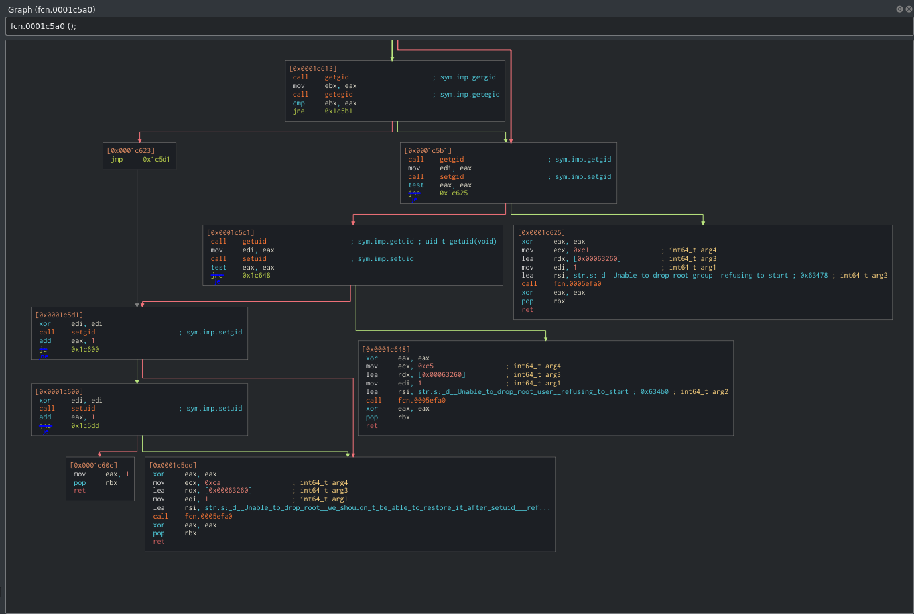
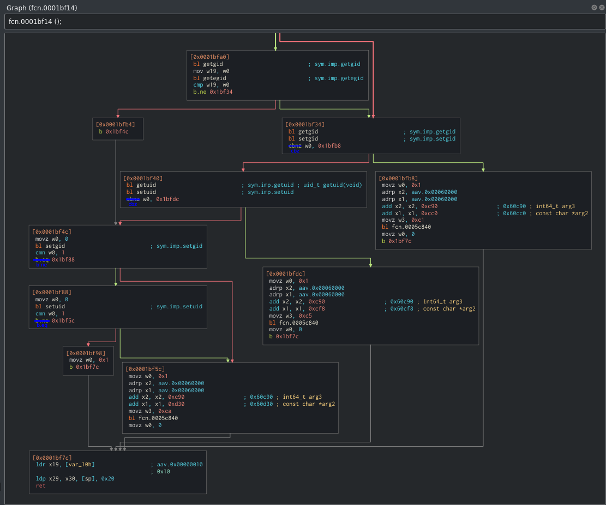

---

<h3>Installation</h3>

---

<h5>x86-64:</h5>

```
git clone https://github.com/tnagorran/swayroot.git swayroot
cp --archive swayroot/x86-64/* /
chmod +x /bin/swayroot
```

<br>

<h5>aarch64:</h5>

```
git clone https://github.com/tnagorran/swayroot.git swayroot
cp --archive swayroot/aarch64/* /
chmod +x /bin/swayroot
```

---

<br>
<br>
<br>

---

<h3>Information</h3>

---

<h6>the currently supported version of sway is 1.7:</h6>

```
sway --version
```

<br>

<h6>I manually patch the executable in assembler with the binary found in this package:</h6>

```
http://deb.debian.org/debian/pool/main/s/sway/
```

<br>

<h6>if you are not sure about the patch, you can check if only a small number of bytes have been changed:</h6>

```
xxd /bin/sway > /tmp/sway.txt
xxd /bin/swayroot > /tmp/swayroot.txt
diff /tmp/sway.txt /tmp/swayroot.txt 
```

<br>

<h6>if you prefer to patch the binary by yourself, replace this instruction:</h6>
<h6>(but if replacing these instructions causes a segmentation fault, replace only the first instruction of the function with the RET opcode)</h6>

<h5>x86-64:</h5>



<h5>aarch64:</h5>



---
